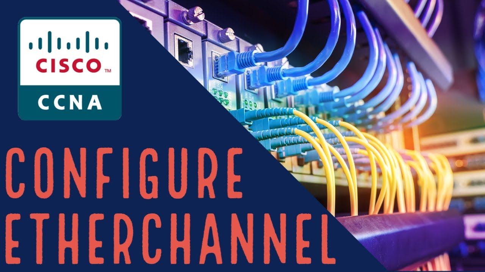

# **EtherChannel & Haute Disponibilité**

  

## 📄 **Description**

Ce dépôt fournit des configurations et des guides pour implémenter **EtherChannel** et **HSRP**, améliorant ainsi la **résilience** et la **disponibilité** réseau. Ces technologies permettent une redondance avancée et une optimisation de la bande passante.

## 📂 **Contenu**

- **Documentation** : Guides techniques dans `doc/`.
- **Illustrations** : Schémas et images dans `img/`.
- **Simulations** : Fichiers Packet Tracer (`.pka`) dans `pka/`.

## ⚙️ **Prérequis**

- Connaissances en configuration des équipements Cisco.
- Utilisation de logiciels comme Cisco Packet Tracer, GNS3 ou EVE-NG.
- Accès à du matériel Cisco ou à un simulateur fonctionnel.

## 🔧 **Configurations Clés**

### **EtherChannel**
- Utiliser l'agrégation de liens pour améliorer la bande passante et la redondance.
- Support des protocoles PAgP, LACP et du mode statique.
- Vérifier la configuration et l'état des EtherChannels.

### **HSRP**
- Configurer des passerelles redondantes pour éviter les interruptions.
- Prioriser et basculer automatiquement en cas de panne.
- Superviser les groupes HSRP actifs et en veille.

## 💪 **Stratégies de Résilience**

- Doubler les équipements réseau pour éliminer les points de défaillance uniques.
- Améliorer la disponibilité et la performance grâce à EtherChannel.
- Mettre en place une surveillance continue pour anticiper les pannes.

## 🐟 **Optimisation**

- Équilibrer le trafic réseau entre plusieurs chemins pour réduire la congestion.
- Activer la préemption HSRP pour garantir le retour du routeur principal.
- Configurer le protocole STP pour éviter les boucles tout en assurant une redondance.
- Planifier des tests réguliers pour valider les configurations et la résilience.

## 📂 **Fichiers Packet Tracer**

1. `Bloc2_sem3-4_atelier-04_redondance_etherchannel-exo-1-depart.pkt`
2. `Bloc2_sem3-4_atelier-04_redondance_HSRP_partie1.pkt`
3. `Bloc2_sem3-4_atelier-04_redondance_Troubleshoot_HSRP.pka`
4. `Bloc2_sem3-4_atelier-04_redondance_etherchannel-avancer.pkt`

### **Date de Création**

Décembre 2024
